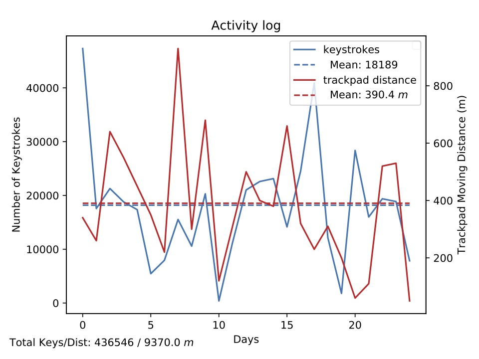

# petit
This is a growing collection of my small programmes.

## Contents
- word_practice: a typing practice programme, inspired by a series of wrong typing when I type the password.
- ascii_confess: a ascii converting programme, used to create a string of asciis, that contains information. I personally used this for love message encryption:- not too hard to decipher, and looks adequately neat.
- Timeline: draw timeline of a list of events.
- ActivityLog: analyse your daily activities, data logged by OctoMouse. Example:
	