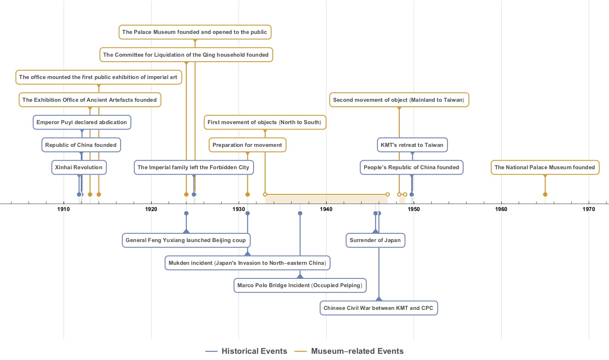
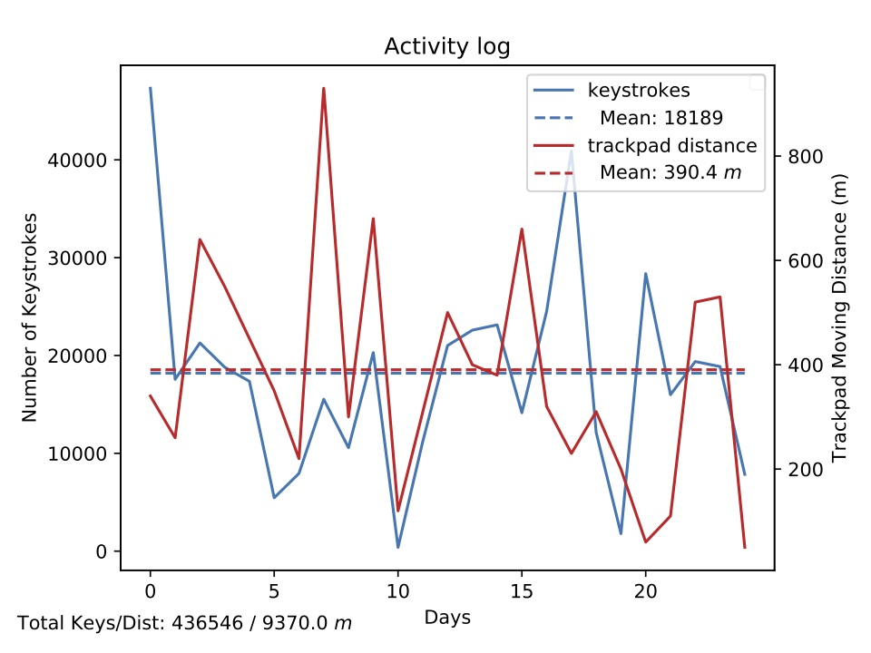

# LePythonPetit
This is a growing collection of my Python scripts and projects.

## Tiny Scripts
- [Word Practice](./src/word_practice.py): A tiny typing practice script, inspired by a series of wrong typing when I type the password.
- [ASCII Confess](./src/ascii_confess.py): An ASCII converting script, used to create a string of asciis, that contains information. I personally used this for love message encryption:- not too hard to decipher, and looks adequately neat.
- [EWFormatter](./src/EWFormatter/ewformatter.py): An auto-formatter for mixed typesetting of East-Asian (Chinese Characters (Hanzi, Kanji, Hanja); Kana; Hangul) and Western (Greek; Latin; Cyrillic) elements.

## Crawlers
- [Esperanto-English-Japanese-Etymology Dictionary](https://gist.github.com/BaksiLi/d4576e7bf3f40b2d98173bbd27dbc9a5): A combined dictionary.

## Visualization
- Timeline: Draw a timeline from a list of events.
	

- (2019) [OctoMouse Activity Visualizer](https://gist.github.com/BaksiLi/c138430c01cfc981efcbbb4c95846a68): Analyse your daily activities, data logged by [OctoMouse](http://konsomejona.github.io/OctoMouse/#support) on macOS.
	

- (2020) [WakaTime Data Visualizer](https://gist.github.com/BaksiLi/d675b683ebaf9fe24a99447f7e1a32c0): Visualize WakaTime data to replace the official (free but ugly) pie chart.
  
  

- (2022) [Sex Activity Visualizer](https://github.com/BaksiLi/sex-stats): This analyzes statistics of logged sex activity data (Apple HealthKit).
